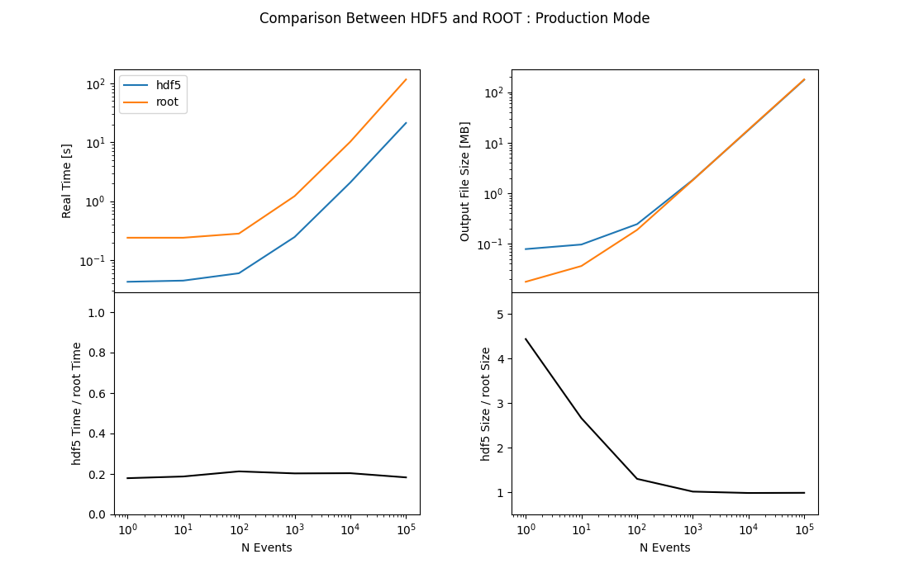

# Bench

Benchmark testing between ROOT-based fire and HDF5-based fire.

The actual compiling and running of this module is done in the
[benchmark GitHub action](../.github/workflows/bench.yml).

In short, after compiling whichever version of the framework we are
using against this module, we run the command

```bash
ldmx time fire config.py <num-events>
```

To time how long the processing takes, and then

```bash
stat output/*
```

To obtain how large the output data file is.

## Run Locally

If you want to run this benchmarking test on your own machine, 
you can use the script that the GitHub workflow uses.
You will need to provide the number of trials per test point
and the event number points to test.
```
source env.sh
source Bench/run.sh
bench 10 1 10 42
```

The plotting script assumes you have `matplotlib` and `pandas` available.
You can install them quickly with `pip`.
```
python3 -m pip install matplotlib pandas
```

And then you can generate plots from the data the `bench` command generated.
```
python3 Bench/plot.py data.csv
```

## Results
The latest results were generated with a GitHub action.
This limits the number of events we can sample because of the 6 hour time limit.
We still are able to compare up to 100k events being written and read.




